# Spark: A CBT Diary
Group 15 Project

## Details

Depression is often linked to feelings of inactivity and discouragement. Studies have shown that increased activity can increase the chances of having more postiive experiences. A Cognitive Behavioral Diary (CBT Diary) primarily is used to allow a user to write down their feelings and breakdown the causes and cutout the negativity from those thoughts. 
	

Our app encourages people with low activity levels to be more active through alerts via a mobile and smartwatch application. Users can better track which activities have a positive or negative impact on their emotions by logging these in as journal entries. Our app makes appropriate suggestions such as telling users to exercise when their activity or mood levels start to drop. Additionally, users can view their progress in terms of amount of sleep, steps walked, emotions logged, and levels of inactivity. By allowing users to add challenges, users will be more motivated on trying to achieve their concrete goals.

## Authors

Nabeel Saleem,
Jeremy Diaz,
Chang Liu,
Smita Jain,
Yiyang Shen.

## Github Link

https://github.com/cs160-sp16/Group-15-Project

## Demo Video

See https://www.youtube.com/watch?v=_OOyMEBN99U

## Screenshots

Setup  
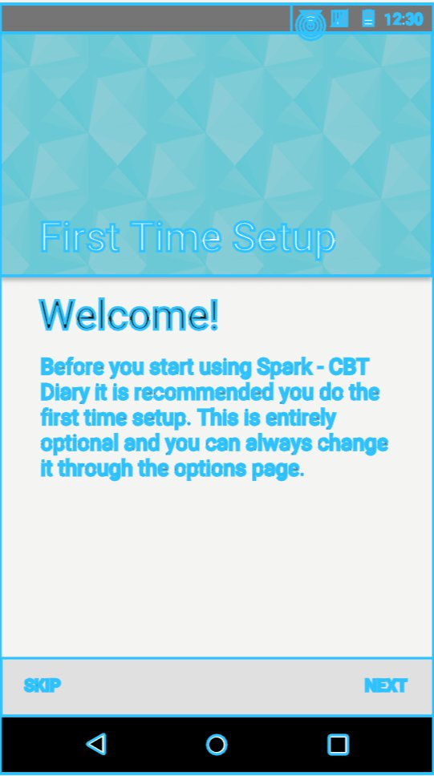
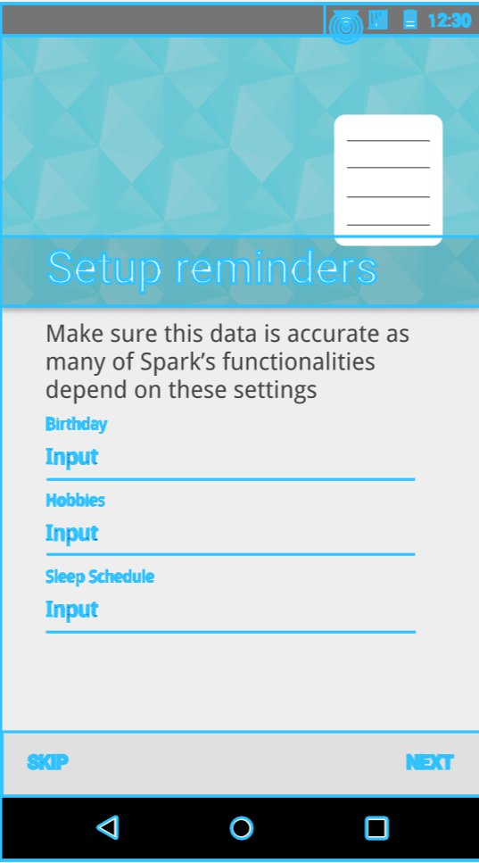
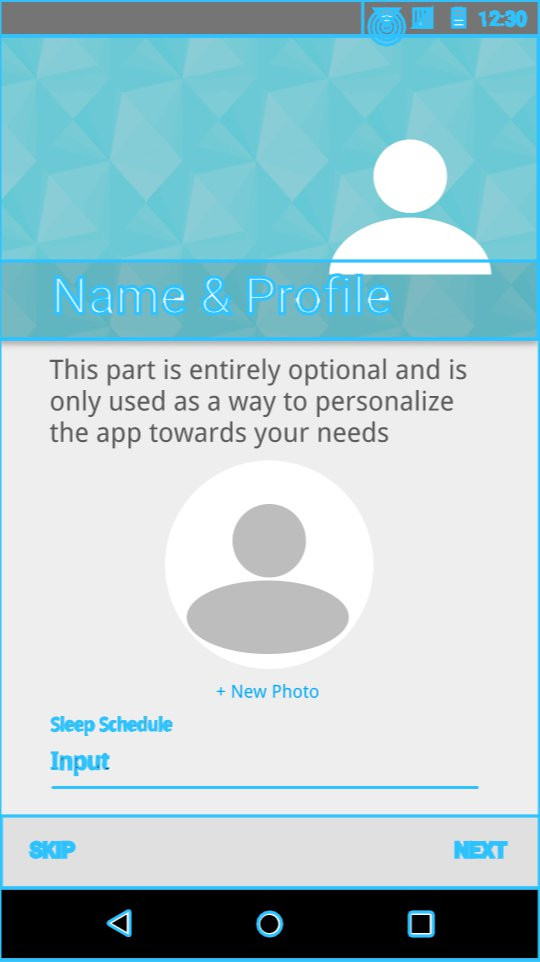

Main Page  
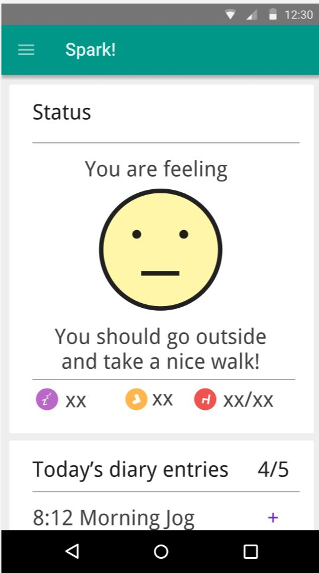

Analytics  
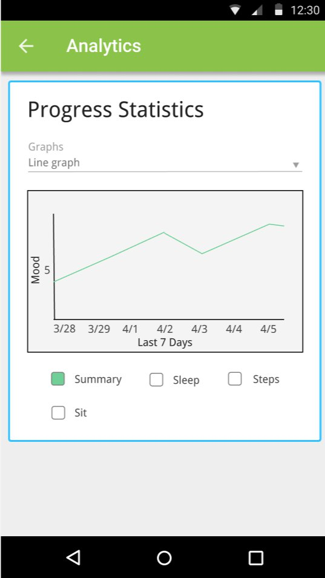

Diary  
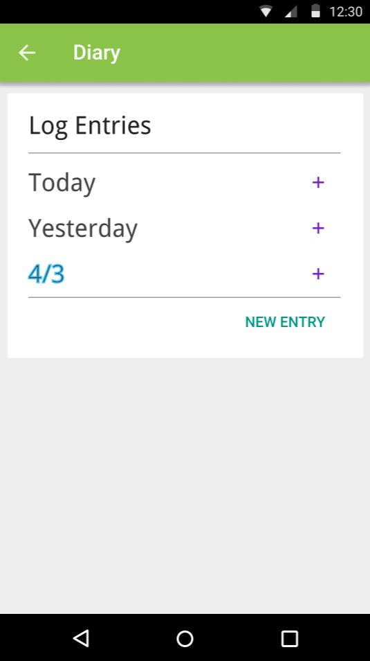
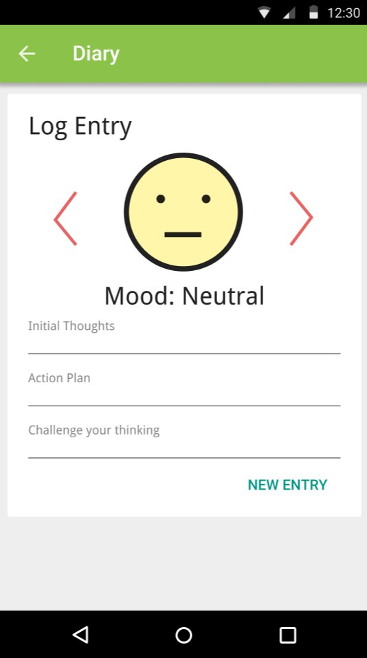

Challenges  
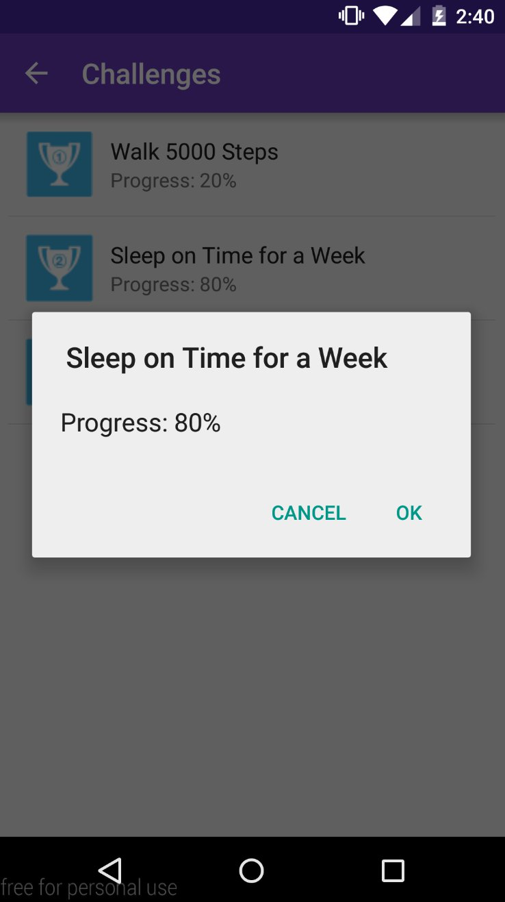

Change your preferences  
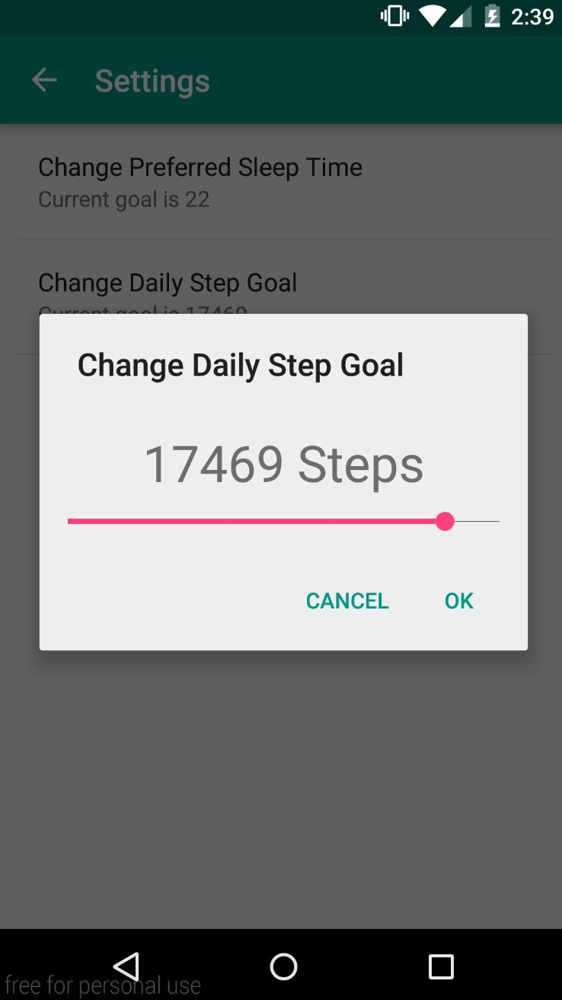

Choose your current mood
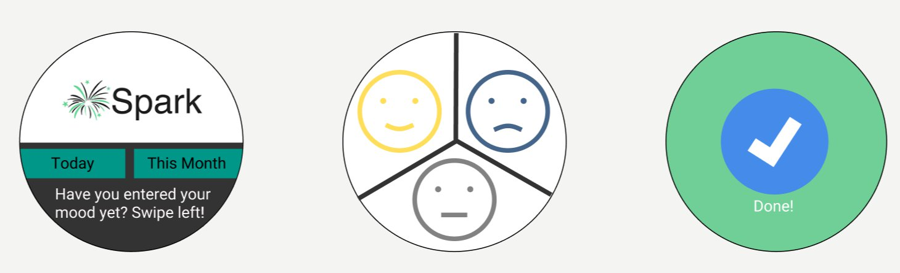

See your improvement
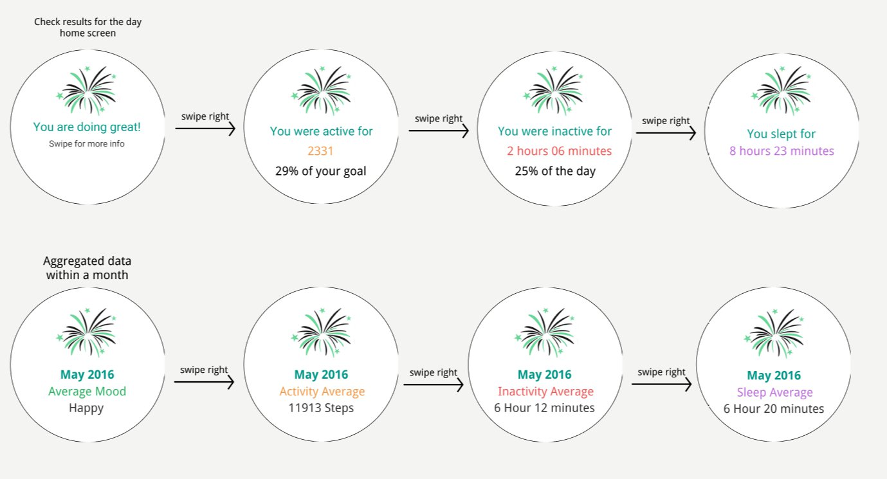

## Acknowledgements

* Many functions were taken and modified from stackoverflow, links to particular pages are commented on top of the function in the source code.
* Many helpful hints were given out on piazza by other students and gsi’s.
* Google’s api guides and class documentations were really useful for implemented certain features.
